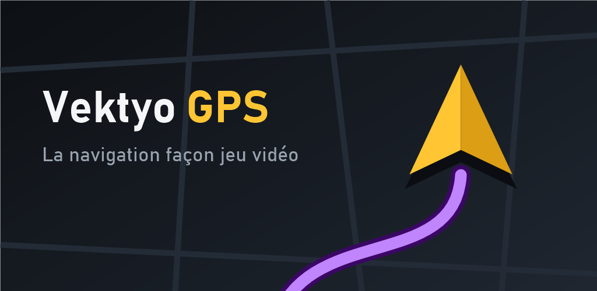

# Game Maps IRL

Un GPS qui ressemble à un jeu vidéo : carte de nuit, itinéraire lumineux, véhicule en 3D.
Application Android native (Kotlin), avec Android Auto.



## Ce que fait l'application

- **Carte** en 3D inclinée ou vue de dessus, plusieurs thèmes, véhicules 3D et couleurs au choix.
- **Navigation** : recherche d'adresses et de lieux, guidage vocal, recalcul automatique,
  Maison / Travail / favoris, guidage écran éteint.
- **Sur la route** : limitation de vitesse, alertes de zones de danger, trafic en temps réel (avec une clé TomTom).
- **Android Auto** : carte, guidage et recherche sur l'écran de la voiture.
- **Mode développeur** : création de thèmes et de véhicules.

## Construire

Il faut Android Studio (ou un JDK 17+) et le SDK Android.

```bash
./gradlew assembleDebug
```

```bash
./gradlew testDebugUnitTest
```

L'APK de test est dans `app/build/outputs/apk/debug/`.

## Publier

La signature et la fiche Play Store sont décrites dans [store/publication.md](store/publication.md).

## Documentation

- [ARCHITECTURE.md](ARCHITECTURE.md) : le rôle de chaque fichier.
- [store/](store/) : logo, bannière, captures, direction artistique, textes de la fiche, politique de confidentialité.

## Données

Carte et lieux © les contributeurs d'OpenStreetMap (OpenFreeMap, Photon, OSRM, Overpass),
adresses de la Base Adresse Nationale, données publiques françaises de contrôle routier.
